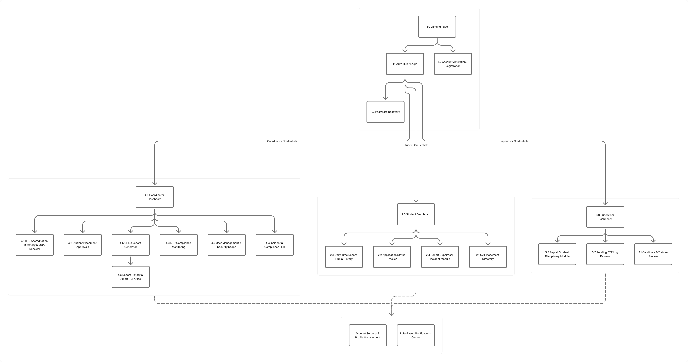

# MenteeLog — OJT & Internship Management System

---

## Project Overview
MenteeLog is a multi-role web platform designed to streamline OJT tracking, DTR logging, HTE accreditation, and compliance reporting for Students, Supervisors, and Coordinators.

---

## System Architecture

---

## Sitemap

---

## Database ERD

---

## Team Roles & Contributions
- **Lead / Project Manager:** Jeff A. Gentapanan
- **Software Generalist:** Kyle Renzo C. Alis
- **UI/UX Designer:** Sean Nichole S. Guipo
- **Frontend Developer:** [Name]
- **Backend Developer:** [Jhodie Alyssa Ladran]
- **Backend Developer:** [Name]
- **Researcher:** Rolly G. Abella
