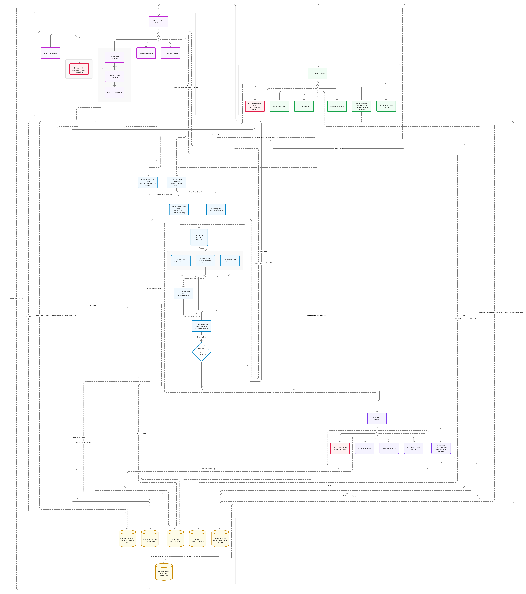
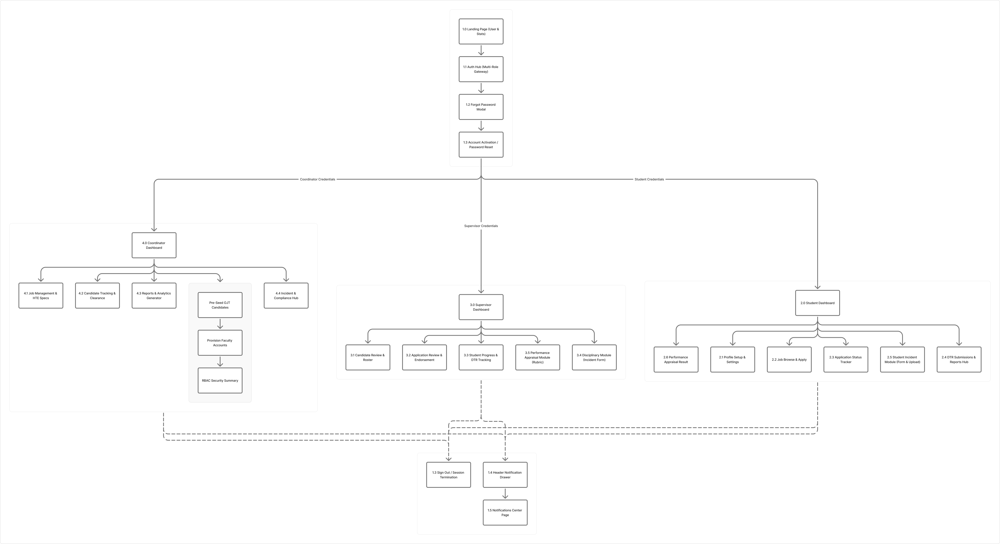
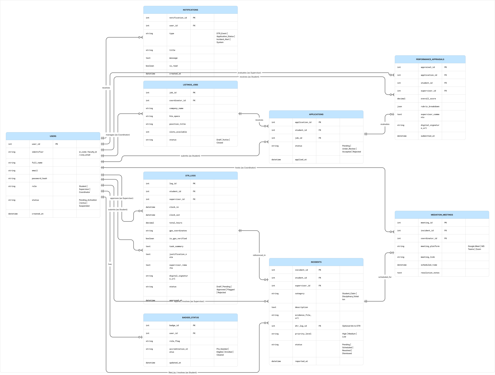

# MenteeLog — OJT & Internship Management System

## Frontend website

The working three-portal frontend is in **[frontend](./frontend/README.md)**. Your design references and team documents are preserved.

Run `cd frontend` then `npm start`, and open **http://127.0.0.1:4173**. No package installation is required. On the sign-in page, select Student, Supervisor, or Coordinator and choose the demo button.

Backend teammates: see **[API integration contract](./frontend/API-CONTRACT.md)** and **[security boundaries](./frontend/SECURITY.md)**. This is a frontend demonstration; real authentication and database services are not connected.

---

## Project Overview
MenteeLog is a multi-role web platform designed to streamline OJT tracking, DTR logging, HTE accreditation, and compliance reporting for Students, Supervisors, and Coordinators.

---

## System Architecture

---

## Sitemap

---

## Database ERD

---

## Team Roles & Contributions
- **Lead / Project Manager:** Jeff A. Gentapanan
- **Software Generalist:** Kyle Renzo C. Alis
- **UI/UX Designer:** Sean Nichole S. Guipo
- **Frontend Developer:** John Paul B. Wendam
- **Backend Developer:** Jhodie Alyssa Ladran
- **Backend Developer:** Cristina Bernadette Porras
- **Researcher:** Rolly G. Abella
