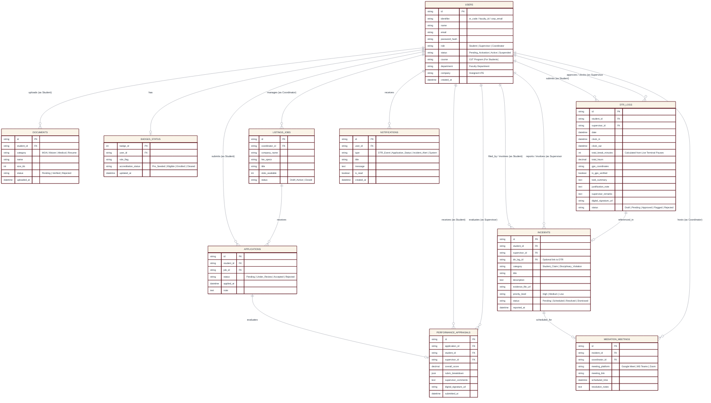

# MenteeLog - OJT & Internship Management System

MenteeLog is a centralized, multi-role web platform designed to streamline On-the-Job Training (OJT) tracking, Daily Time Record (DTR) logging, Host Training Establishment (HTE) accreditation, and compliance reporting across Philippine universities.

## 🚀 Live Frontend Demonstration

The working three-portal frontend is located in the **[frontend-react](./frontend-react/)** directory. 

To run the local development server:
```bash
cd frontend-react
npm install
npm run dev
```

### Sample Demo Accounts
*(Password for all demo accounts: `Demo@2026!`)*

| Portal | Identifier | Role |
| --- | --- | --- |
| **Student** | `2021-00421` | OJT Trainee (Read-Only DTR) |
| **Supervisor** | `carlos.jose@example.com` | Industry Partner (Timekeeper Authority) |
| **Coordinator** | `FAC-2026-001` | Faculty Admin (Compliance Review) |

*Note: This is currently a frontend prototype. Real authentication and Supabase PostgreSQL services are staged for integration.*

---

## ✨ Key Features & Recent Updates

We have recently overhauled the system to ensure robust attendance integrity, flawless cross-device usability, and buttery-smooth interactions:

* **Absolute-Authority Timekeeping (Supervisor Terminal):** Supervisors now have complete control over student attendance via a live Timekeeper Terminal. They manage Clock Ins, Break Starts, Break Ends, and Clock Outs directly.
* **Read-Only Student DTR Dashboard:** Students no longer manually punch their own hours. They are provided a live, read-only dashboard that reacts instantly when their supervisor clocks them in or out.
* **Granular Break Tracking & Coordinator Compliance:** Break times are strictly tracked and calculated into the total weekly hours. Coordinators can audit break minutes and compliance directly from their Weekly Logs view.
* **Mobile-Responsive Authentication:** The Activate and Sign-In pages have been meticulously tailored to snap perfectly into column layouts on mobile screens without overflow or horizontal scrolling.
* **Buttery-Smooth UI Physics:** The entire frontend has been upgraded with a high-performance CSS transition layer. Janky button bounces have been replaced with professional ease-out curves, modals fade in cleanly, and dashboard cards glide into place without flashing.

---

## 👥 Team Roles & Contributions

* **Project Manager:** Jeff A. Gentapanan
* **Software Generalist:** Kyle Renzo C. Alis
* **UI/UX Designer:** Cristina Bernadette Porras
* **Frontend Developer:** John Paul B. Wendam
* **Backend Developer:** Jhodie Alyssa Ladran
* **Backend Developer:** Sean Nichole S. Guipo
* **Researcher:** Rolly G. Abella

*(Note: Roles updated as per the latest Software Product Justification proposal).*

---

## 🗺️ System Architecture Flowchart


```mermaid
---
config:
  layout: elk
  theme: base
  themeVariables:
    fontFamily: 'Inter, system-ui, -apple-system, sans-serif'
    fontSize: '13px'
    primaryColor: '#EFDFBB'
    primaryTextColor: '#1F2937'
    primaryBorderColor: '#58111A'
    lineColor: '#6B7280'
    tertiaryColor: '#FAF4E8'
    clusterBkg: '#FAF4E8'
    clusterBorder: '#EFDFBB'
---
graph TD
    %% 1. PUBLIC & AUTHENTICATION PORTAL
    subgraph PublicAuth ["1.0 Public & Authentication Portal"]
        P1["1.0 Landing Page (Hero & Stats)"]
        P2["1.1 Auth Hub (Multi-Role Gateway)"]
        P3["1.2 Forgot Password Modal"]
        P4["1.3 Account Activation / Password Reset"]
        P1 --> P2
        P2 --> P3
        P3 --> P4
    end

    %% 2. OJT STUDENT PORTAL
    subgraph StudentPortal ["2.0 OJT Student Portal"]
        S0["2.0 Student Dashboard"]
        S1["2.1 Profile Setup & Settings"]
        S2["2.2 Job Browse & Apply"]
        S3["2.3 Application Status Tracker"]
        S4["2.4 Live DTR Dashboard & Weekly Submissions (Read-Only)"]
        S5["2.5 Student Incident Module (Form & Upload)"]
        S6["2.6 Performance Appraisal Result"]
        S7["2.7 Documents & Requirements"]
        S0 --> S1
        S0 --> S2
        S0 --> S3
        S0 --> S4
        S0 --> S5
        S0 --> S6
        S0 --> S7
    end

    %% 3. COMPANY SUPERVISOR PORTAL
    subgraph SupervisorPortal ["3.0 Company Supervisor Portal"]
        Sup0["3.0 Supervisor Dashboard"]
        Sup1["3.1 Candidate Review & Roster"]
        Sup2["3.2 Application Review & Endorsement"]
        Sup3["3.3 Student Progress & Live Timekeeper Terminal (Clock In/Out, Breaks)"]
        Sup4["3.4 Disciplinary Module (Incident Form)"]
        Sup5["3.5 Performance Appraisal Module (Rubric)"]
        Sup6["3.6 Slot Management"]
        Sup0 --> Sup1
        Sup0 --> Sup2
        Sup0 --> Sup3
        Sup0 --> Sup4
        Sup0 --> Sup5
        Sup0 --> Sup6
    end

    %% 4. FACULTY OJT COORDINATOR / ADMIN PORTAL
    subgraph CoordinatorPortal ["4.0 Faculty OJT Coordinator Portal"]
        C0["4.0 Coordinator Dashboard"]
        C1["4.1 Job Management"]
        C2["4.2 HTE Accreditation"]
        C3["4.3 Student Placement"]
        C4["4.4 DTR Compliance Review (Weekly Logs & Breaks)"]
        C5["4.5 Report Generation"]
        C6["4.6 Incident Reports"]
        
        subgraph UserGov ["4.7 User Management Scope"]
            C7_1["Pre-Seed OJT Candidates<br/>(CSV: identifier, name, email, course)"]
            C7_2["Provision Faculty Accounts"]
            C7_3["RBAC Security Summary"]
            C7_1 --> C7_2
            C7_2 --> C7_3
        end
        C0 --> C1
        C0 --> C2
        C0 --> C3
        C0 --> C4
        C0 --> C5
        C0 --> C6
        C0 --> UserGov
    end

    %% 5. SHARED NAVIGATION & SYSTEM SERVICES
    subgraph SharedServices ["Shared Navigation & System Overlay"]
        Sh1["1.3 Sign Out / Session Termination"]
        Sh2["1.4 Header Notification Drawer"]
        Sh3["1.5 Notifications Center Page"]
        Sh2 --> Sh3
    end

    P4 -->|Student Credentials| S0
    P4 -->|Supervisor Credentials| Sup0
    P4 -->|Coordinator Credentials| C0

    StudentPortal -.-> Sh1
    SupervisorPortal -.-> Sh1
    CoordinatorPortal -.-> Sh1
    StudentPortal -.-> Sh2
    SupervisorPortal -.-> Sh2
    CoordinatorPortal -.-> Sh2

    classDef publicAuth fill:#FAF4E8,stroke:#EFDFBB,stroke-width:2px,color:#58111A
    classDef studentPortal fill:#FFFFFF,stroke:#EFDFBB,stroke-width:2px,color:#1F2937
    classDef supervisorPortal fill:#FFFFFF,stroke:#6B7280,stroke-width:2px,color:#1F2937
    classDef coordinatorPortal fill:#FFFFFF,stroke:#58111A,stroke-width:2px,color:#1F2937
    classDef sharedServices fill:#EFDFBB,stroke:#58111A,stroke-width:2px,color:#58111A
    classDef redReport fill:#58111A,stroke:#58111A,stroke-width:2px,color:#FAF4E8

    class P1,P2,P3,P4 publicAuth
    class S0,S1,S2,S3,S4,S5,S6,S7 studentPortal
    class Sup0,Sup1,Sup2,Sup3,Sup4,Sup5,Sup6 supervisorPortal
    class C0,C1,C2,C3,C4,C5,C6,C7_1,C7_2,C7_3 coordinatorPortal
    class Sh1,Sh2,Sh3 sharedServices
    class C6,S5,Sup4 redReport 
```

---

## 🗄️ Database Entity-Relationship Diagram (ERD)


```mermaid
---
config:
  theme: base
  themeVariables:
    fontFamily: 'Inter, system-ui, -apple-system, sans-serif'
    fontSize: '13px'
    primaryColor: '#FAF4E8'
    primaryTextColor: '#1F2937'
    primaryBorderColor: '#58111A'
    lineColor: '#6B7280'
    secondaryColor: '#EFDFBB'
    tertiaryColor: '#FFFFFF'
---
erDiagram
    USERS {
        string id PK
        string identifier "sr_code / faculty_id / corp_email"
        string name
        string email
        string password_hash
        string role "Student | Supervisor | Coordinator"
        string status "Pending_Activation | Active | Suspended"
        string course "OJT Program (For Students)"
        string department "Faculty Department"
        string company "Assigned HTE"
        datetime created_at
    }

    DOCUMENTS {
        string id PK
        string student_id FK
        string category "MOA | Waiver | Medical | Resume"
        string name
        int size_kb
        string status "Pending | Verified | Rejected"
        datetime uploaded_at
    }

    BADGES_STATUS {
        int badge_id PK
        string user_id FK
        string role_flag
        string accreditation_status "Pre_Seeded | Eligible | Enrolled | Cleared"
        datetime updated_at
    }

    LISTINGS_JOBS {
        string id PK
        string coordinator_id FK
        string company_name
        string hte_specs
        string title
        int slots_available
        string status "Draft | Active | Closed"
    }

    APPLICATIONS {
        string id PK
        string student_id FK
        string job_id FK
        string status "Pending | Under_Review | Accepted | Rejected"
        datetime applied_at
        text note
    }

    DTR_LOGS {
        string id PK
        string student_id FK
        string supervisor_id FK
        datetime date
        datetime clock_in
        datetime clock_out
        int total_break_minutes "Calculated from Live Terminal Pauses"
        decimal total_hours
        string gps_coordinates
        boolean is_gps_verified
        text task_summary
        text justification_note
        text supervisor_remarks
        string digital_signature_url
        string status "Draft | Pending | Approved | Flagged | Rejected"
    }

    PERFORMANCE_APPRAISALS {
        string id PK
        string application_id FK
        string student_id FK
        string supervisor_id FK
        decimal overall_score
        json rubric_breakdown
        text supervisor_comments
        string digital_signature_url
        datetime submitted_at
    }

    INCIDENTS {
        string id PK
        string student_id FK
        string supervisor_id FK
        string dtr_log_id FK "Optional link to DTR"
        string category "Student_Claim | Disciplinary_Violation"
        string title
        text description
        string evidence_file_url
        string priority_level "High | Medium | Low"
        string status "Pending | Scheduled | Resolved | Dismissed"
        datetime reported_at
    }

    MEDIATION_MEETINGS {
        string id PK
        string incident_id FK
        string coordinator_id FK
        string meeting_platform "Google Meet | MS Teams | Zoom"
        string meeting_link
        datetime scheduled_time
        text resolution_notes
    }

    NOTIFICATIONS {
        string id PK
        string user_id FK
        string type "DTR_Event | Application_Status | Incident_Alert | System"
        string title
        text message
        boolean is_read
        datetime created_at
    }

    %% RELATIONSHIPS
    USERS ||--o| BADGES_STATUS : "has"
    USERS ||--o{ DOCUMENTS : "uploads (as Student)"
    USERS ||--o{ APPLICATIONS : "submits (as Student)"
    USERS ||--o{ LISTINGS_JOBS : "manages (as Coordinator)"
    LISTINGS_JOBS ||--o{ APPLICATIONS : "receives"
    
    USERS ||--o{ DTR_LOGS : "submits (as Student)"
    USERS ||--o{ DTR_LOGS : "approves / clocks (as Supervisor)"
    
    APPLICATIONS ||--o| PERFORMANCE_APPRAISALS : "evaluates"
    USERS ||--o{ PERFORMANCE_APPRAISALS : "receives (as Student)"
    USERS ||--o{ PERFORMANCE_APPRAISALS : "evaluates (as Supervisor)"

    USERS ||--o{ INCIDENTS : "filed_by / involves (as Student)"
    USERS ||--o{ INCIDENTS : "reports / involves (as Supervisor)"
    DTR_LOGS ||--o| INCIDENTS : "referenced_in"
    
    INCIDENTS ||--o| MEDIATION_MEETINGS : "scheduled_for"
    USERS ||--o{ MEDIATION_MEETINGS : "hosts (as Coordinator)"
    
    USERS ||--o{ NOTIFICATIONS : "receives" 
```
